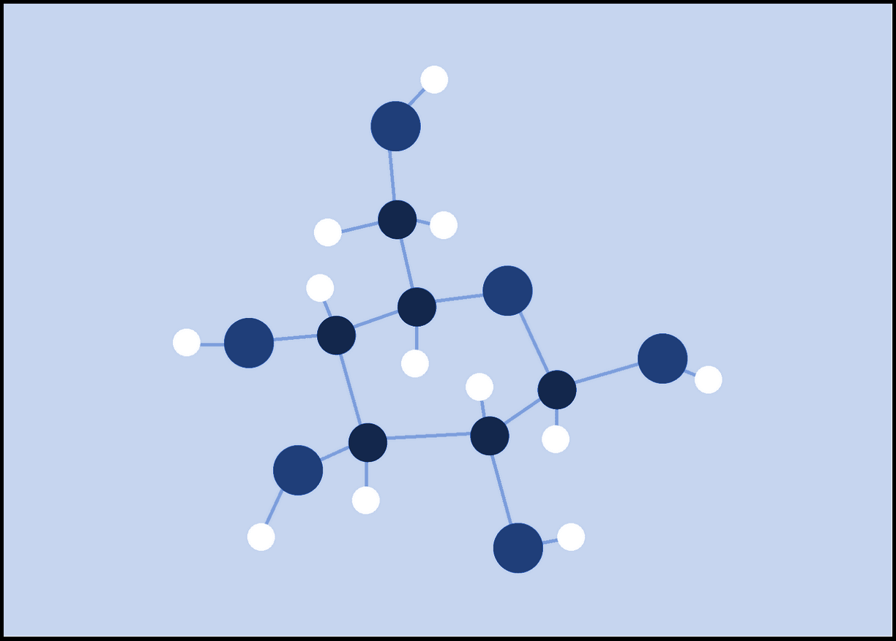
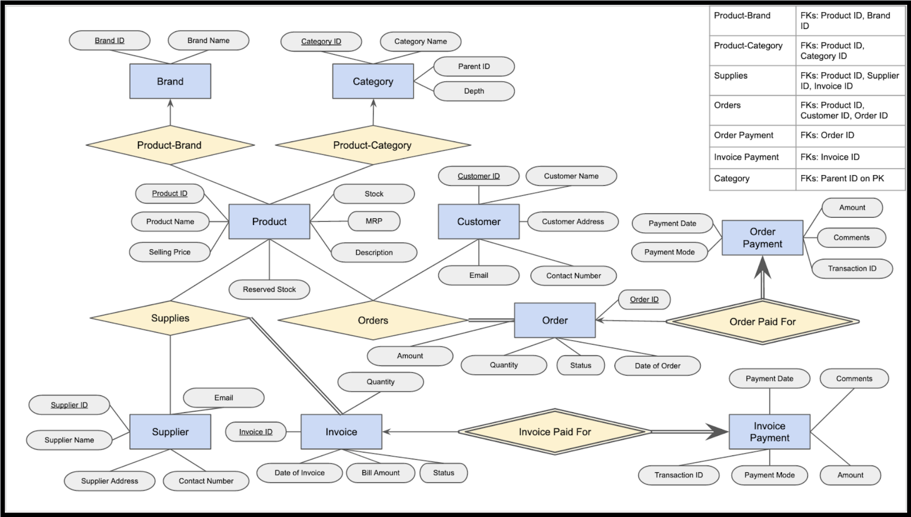

<!-- Output copied to clipboard! -->

<!-----

You have some errors, warnings, or alerts. If you are using reckless mode, turn it off to see inline alerts.
* ERRORs: 0
* WARNINGs: 0
* ALERTS: 4

Conversion time: 2.793 seconds.


Using this Markdown file:

1. Paste this output into your source file.
2. See the notes and action items below regarding this conversion run.
3. Check the rendered output (headings, lists, code blocks, tables) for proper
   formatting and use a linkchecker before you publish this page.

Conversion notes:

* Docs to Markdown version 1.0β33
* Tue Aug 02 2022 01:20:42 GMT-0700 (PDT)
* Source doc: DBMS - Final Project Report - Group 3
* Tables are currently converted to HTML tables.
* This document has images: check for >>>>>  gd2md-html alert:  inline image link in generated source and store images to your server. NOTE: Images in exported zip file from Google Docs may not appear in  the same order as they do in your doc. Please check the images!

----->

# <p align="center">Inventory Management System</p> 

### <p align="center">CS3120 - Database Management Systems Laboratory Course Project</p>

### Contributors

* Anurag Jha 		(111901010)
* Deon Saji 		(111901022)
* Naren Loganathan 	(111901056)

## Introduction:

Inventory management, in our context, involves the tracking of inventory (a list of items or goods) from manufacturers to a storeroom. It also involves the tracking of inventory from this storeroom to various customers.

To be more precise, we track invoices that are made by the storeroom to suppliers (manufacturers). We also keep tabs on orders that are made by customers to our storeroom. Payment information pertaining to these invoices and orders are also stored. Additionally, we maintain a well organized collection of products, along with the quantities that we currently have in stock. We also store relevant information about our customers and suppliers.

<p align ="center">

</p>

## ER Model:

The structure of our database (in the form of an entity - relationship model) consists of:


* **9** entities (2 being weak)
* **6** relationships.

**The entities (9):**


* **Brand** - Each member of this entity class represents a brand / company name. Multiple products can ‘belong’ to a single brand.
* **Category** - Each member of this entity class represents a specific product category. Multiple products in our inventory can fall into the same category. Categories can also have subcategories (a hierarchical structure can be made here).
* **Product** - Represents the items we can stock up in our inventory. Attributes include the product name, description, maximum retail price, as well the quantity that we currently have in stock (+ reserved stock).
* **Customer** - Each member corresponds to information about a customer. The attributes of this entity include the customer’s name, address & contact number + email address.
* **Supplier** - Represents the organizations / companies that supply us with various products. Attributes include the supplier name, address, contact number & email address.
* **Invoice** - Each member contains information about a particular order that we’ve made to a supplier. Some attributes: Invoice date, bill amount, quantity and status (whether the order has been fulfilled or not).
* **Order** - Each member corresponds to information about a particular order that a customer has made to us. Attributes: Order date, amount, quantity and status (whether the order has been fulfilled or not).
* **Invoice Payment** - The attributes of this (weak) entity class include payment amount, date of payment, mode of payment, transaction ID and comments. This entity details the payment information relating to supplier invoices.
* **Order Payment** - The attributes of this (weak) entity class include payment amount, date of payment, mode of payment, transaction ID and comments. This entity details the payment information relating to customer orders.

**The relationships (6):**


* **Product-Brand** - Connects products to their respective brands (if they belong to one). We thought of including total participation from products here, but that may create trouble when documenting products that do not actually belong to a brand (or are unbranded). The relation is many-to-one, in the sense that multiple products can belong to the same brand.
* **Product-Category** - Connects products to their respective product categories (if they belong to one). The relation is many-to-one, in the sense that multiple products can fall into the same category.
* **Supplies** - This relation joins members of the Supplier, Product and Invoice entity classes, and is used to represent the overall transfer of inventory from suppliers to our storeroom. We create an invoice to purchase a specific quantity of a particular product at some fixed price from some supplier. All of this is captured through this relation. All invoice members partake in this relation - so there’s total participation.
* **Orders** - This relation joins members of the Customer, Product and Order entity classes, and is used to represent the overall transfer of inventory from our storeroom to customers (consumers & other vendors). A customer places an order to buy a specific quantity of a particular product at some fixed price from our inventory. All of this is captured through this relation. All order members partake in this relation - so there’s total participation.
* **Invoice Paid For** - This relation connects invoices to their respective payment transactions.
* **Order Paid For** - This relation connects orders to their respective payment transactions.

**The ER Diagram:**

The resulting diagram:

<p align ="center">

</p>

## Relational Model:

A relational model is a way of conceptually representing and managing data in a database by putting it into tables.

Upon converting the previously mentioned Entity - Relationship diagram into a Relational Model, we obtain the following tables:

**Tables constructed from the entities (9):**


1. brand (<span style="text-decoration:underline;">brand_id</span>, brand_name)
2. category (<span style="text-decoration:underline;">category_id</span>, category_name, parent_id, depth)
3. product (<span style="text-decoration:underline;">product_id</span>, product_name, description, mrp, selling_price, stock, reserved_stock)
4. customer (<span style="text-decoration:underline;">customer_id</span>, name, address, contact_number, email)
5. supplier (<span style="text-decoration:underline;">supplier_id</span>, name, address, contact_number, email)
6. invoice (<span style="text-decoration:underline;">invoice_id</span>, invoice_date, quantity, bill_amount, status)
7. customer_order (<span style="text-decoration:underline;">order_id</span>, order_date, amount, status)
8. invoice_payment (<span style="text-decoration:underline;">invoice_id</span>, transaction_id, amount, payment_date, payment_mode, comments)
9. customer_payment (<span style="text-decoration:underline;">order_id</span>, transaction_id, amount, payment_date, payment_mode, comments)

**Tables constructed from the relationships (4):**


1. product_brand (<span style="text-decoration:underline;">product_id</span>, brand_id)
2. product_category (<span style="text-decoration:underline;">product_id</span>, category_id)
3. supplies (<span style="text-decoration:underline;">invoice_id</span>, supplier_id, product_id, price_per_unit, quantity)
4. orders (<span style="text-decoration:underline;">order_id</span>, customer_id, product_id, price_per_unit, quantity)

## Table Constraints:

Constraints set restrictions on how much and what kind of data can be inserted, modified, and deleted from a table. Constraints are used to ensure data integrity during an update, removal, or insert operation on a table.

Below are the constraints that we impose on the constructed tables:

**Constraints on tables constructed from the entities (9):**


1. **brand**: This table lists the various brands of the products in our inventory. The brand_id is the primary key, and clearly, the brand_name column should never be left empty.

```sql
-- Table storing a list of brands of products.
CREATE TABLE IF NOT EXISTS brand (
   brand_id SERIAL PRIMARY KEY,
   brand_name VARCHAR(50) NOT NULL
);
```


2. **category**: This table lists the various categories of the products contained in our inventory. The category_id is the primary key, and the category_name column should never contain null values (defeats the purpose). Categories can contain subcategories, and to maintain this hierarchical structure, we also have the fields parent_id (which happens to be a foreign key on category_id, but can be left empty if the category doesn’t have a parent) and depth (a non-negative integer).

```sql
-- Table storing a list of various product categories.
CREATE TABLE IF NOT EXISTS category (
   category_id SERIAL PRIMARY KEY,
   category_name VARCHAR(50) NOT NULL,
   parent_id INT REFERENCES category(category_id),
   depth INT CHECK (depth >= 0)
);
```


3. **product**: This table lists the products in our inventory, and also contains relevant information about them, courtesy of the description and mrp (maximum retail price, which has to be some positive value) attributes. We also keep track of the number of pieces of this product that we currently have in our inventory (so stock has to be a non-negative integer). We also have a field titled reserved_stock (again, a non-negative integer) to keep track of the number of pending units that need to be dispatched to customers.

```sql
-- Table storing details about products in our inventory.
CREATE TABLE IF NOT EXISTS product (
   product_id SERIAL PRIMARY KEY,
   product_name VARCHAR(50) NOT NULL,
   description VARCHAR(200),
   mrp NUMERIC(10, 2) NOT NULL CHECK (mrp > 0),
   selling_price NUMERIC(10, 2) NOT NULL CHECK (
       selling_price > 0 AND
       selling_price <= mrp
   ),
   stock INT NOT NULL DEFAULT 0 CHECK (stock >= 0),
   reserved_stock INT NOT NULL DEFAULT 0 CHECK (reserved_stock >= 0)
);
```


4. **customer**: This table contains details about our customers, including their name, address, contact number (which has to be a valid phone number - we’ve implemented a CHECK to handle this suitably) and email address (again, we have a CHECK for confirming validity). Each customer is assigned a unique id, which is used as the primary key in this table.

```sql
-- Table storing details about our customers.
CREATE TABLE IF NOT EXISTS customer (
   customer_id SERIAL PRIMARY KEY,
   name VARCHAR(50) NOT NULL,
   address VARCHAR(200) NOT NULL,
   contact_number CHAR(10) NOT NULL CHECK (contact_number NOT LIKE '%[^0-9]%'),
   email VARCHAR(30) NOT NULL CHECK (email LIKE '%_@__%.__%')
);
```


5. **supplier**: This table contains details about our suppliers, including their name, address, valid contact number and email address. Each supplier is assigned a unique id, which is the primary key here.

```sql
-- Table storing details about our suppliers.
CREATE TABLE IF NOT EXISTS supplier (
   supplier_id SERIAL PRIMARY KEY,
   name VARCHAR(50) NOT NULL,
   address VARCHAR(200) NOT NULL,
   contact_number CHAR(10) NOT NULL CHECK (contact_number NOT LIKE '%[^0-9]%'),
   email VARCHAR(30) NOT NULL CHECK (email LIKE '%_@__%.__%')
);
```


6. **invoice**: This table contains details regarding our invoices. A unique id is assigned to each invoice (the primary key). We also store details such as the time of creation, invoice bill amount (numeric), quantity ordered (a non-negative integer) and the current status of the invoice (i.e. whether we’ve paid the supplier / not paid / cancelled and rendered the invoice void). Relevant constraints have been added.

```sql
-- Table storing details about our invoices to suppliers.
CREATE TABLE IF NOT EXISTS invoice (
   invoice_id SERIAL PRIMARY KEY,
   invoice_date TIMESTAMP NOT NULL DEFAULT NOW(),
   quantity INT NOT NULL CHECK (quantity > 0),
   bill_amount NUMERIC(10, 2) NOT NULL CHECK (bill_amount > 0),
   status VARCHAR(50) NOT NULL DEFAULT 'NOT PAID' CHECK (
       status = 'PAID' OR
       status = 'NOT PAID' OR
       status = 'CANCELLED'
   )
);
```


7. **customer_order**: Similar to the *invoice* table, this table contains details about the orders of customers. Each order is given a unique value (order_id is the primary key). We also keep track of the time of creation, bill amount, the quantity ordered, and the payment status of the order in this table. Relevant constraints have been added.

```sql
-- Table storing details about our customers' orders.
CREATE TABLE IF NOT EXISTS customer_order (
   order_id SERIAL PRIMARY KEY,
   order_date TIMESTAMP NOT NULL DEFAULT NOW(),
   amount NUMERIC(10, 2) NOT NULL CHECK (amount > 0),
   quantity INT NOT NULL CHECK (quantity > 0),
   status VARCHAR(50) NOT NULL DEFAULT 'NOT PAID' CHECK (
       status = 'PAID' OR
       status = 'NOT PAID' OR
       status = 'CANCELLED'
   )
);
```


8. **invoice_payment**: This table stores information regarding invoice payment. The invoice_id attribute here is a foreign key and references valid invoice ids in the invoice table. The table stores payment information pertaining to the invoices sent to us, including the transaction id (UUID), paid amount (numeric), date of payment (timestamp) and the payment mode (cash / card / digital).

```sql
-- Table storing payment information pertaining to our invoices.
CREATE TABLE IF NOT EXISTS invoice_payment (
   invoice_id INT PRIMARY KEY REFERENCES invoice(invoice_id),
   transaction_id UUID NOT NULL DEFAULT uuid_generate_v4(),
   amount NUMERIC(10, 2) NOT NULL CHECK (amount > 0),
   payment_date TIMESTAMP NOT NULL DEFAULT NOW(),
   payment_mode VARCHAR(50) NOT NULL DEFAULT 'CASH' CHECK (
       payment_mode = 'CASH' OR
       payment_mode = 'CARD' OR
       payment_mode = 'DIGITAL'
   ),
   comments VARCHAR(200)
);
```


9. **customer_payment**: Similar to invoice_payment, this table stores the payment information of order payers. The order_id attribute here is a foreign key and references valid order ids in the customer_order table.

```sql
-- Table storing payment information pertaining to our customers' orders.
CREATE TABLE IF NOT EXISTS customer_payment (
   order_id INT PRIMARY KEY REFERENCES customer_order(order_id),
   transaction_id UUID NOT NULL DEFAULT uuid_generate_v4(),
   amount NUMERIC(10, 2) NOT NULL CHECK (amount > 0),
   payment_date TIMESTAMP NOT NULL DEFAULT NOW(),
   payment_mode VARCHAR(50) NOT NULL DEFAULT 'CASH' CHECK (
       payment_mode = 'CASH' OR
       payment_mode = 'CARD' OR
       payment_mode = 'DIGITAL'
   ),
   comments VARCHAR(200)
);
```


**Constraints on tables constructed from the relationships (4):**


1. **product_brand**: This table relates products to their respective brands, and contains mappings from product_id to brand_id. Since the relationship is many to one, we make product_id the primary key. Both attributes are also foreign keys.

```sql
-- Table relating products to their respective brands (if they exist).
CREATE TABLE IF NOT EXISTS product_brand (
   product_id INT PRIMARY KEY REFERENCES product(product_id),
   brand_id INT NOT NULL REFERENCES brand(brand_id)
);
```


2. **product_category**: This table relates products to their respective categories, and contains mappings from product_id to category_id. Since the relationship is many to one, we make product_id the primary key. Also, both of the attributes happen to be foreign keys.

```sql
-- Table relating products to their respective categories (if they exist).
CREATE TABLE IF NOT EXISTS product_category (
   product_id INT PRIMARY KEY REFERENCES product(product_id),
   category_id INT NOT NULL REFERENCES category(category_id)
);
```


3. **supplies**: This table connects the *invoice*, *supplier* and *product* tables. There are three foreign key constraints - one on each attribute. Since every invoice_id in this table is distinct, it made sense to also make it the primary key for this table.

```sql
-- Table to denote the supplying relationship.
CREATE TABLE IF NOT EXISTS supplies (
   invoice_id INT PRIMARY KEY REFERENCES invoice(invoice_id),
   supplier_id INT NOT NULL REFERENCES supplier(supplier_id),
   product_id INT NOT NULL REFERENCES product(product_id)
);
```


4. **orders**: This table connects *customer_order*, *customer* and *product* tables. There are three foreign key constraints - one on each attribute. Since every order_id in this table is distinct, it made sense to also make it the primary key for this table.

```sql
-- Table to denote the ordering relationship.
CREATE TABLE IF NOT EXISTS orders (
   order_id INT PRIMARY KEY REFERENCES customer_order(order_id),
   customer_id INT NOT NULL REFERENCES customer(customer_id),
   product_id INT NOT NULL REFERENCES product(product_id)
);
```


## Procedures and Functions:

We list **4** stored procedures & **2** functions.


1. When a customer places an order for a certain quantity of some product, multiple tables need to be updated. Owing to the complexity, we wrapped this into a stored procedure titled *place_order*, which takes in the customer’s ID, product ID and quantity as arguments. The procedure first checks whether there is sufficient stock of the requested product. If so, it removes the required amount of stock and places it in the reserved category. The bill amount is also calculated beforehand, and new entries are created in the tables *orders* and *customer_order*.

```sql
-- Procedure to simulate a customer placing an order.
CREATE OR REPLACE PROCEDURE place_order(cust_id INT, pdt_id INT, qty INT)
AS $$
DECLARE ord_id INT;
DECLARE amt INT;
BEGIN
   BEGIN
       IF (qty <= (SELECT stock FROM product WHERE product_id = pdt_id)) THEN
           -- Calculating the bill amount beforehand.
           SELECT selling_price INTO amt FROM product WHERE product_id = pdt_id;
           amt = amt * qty;
           -- Create a new entry in customer_order, retrieve the generated order_id.
           INSERT INTO customer_order(quantity, amount) VALUES (qty, amt) RETURNING order_id INTO ord_id;
           -- Create a new entry in the orders relational table.
           INSERT INTO orders(order_id, customer_id, product_id) VALUES (ord_id, cust_id, pdt_id);

           -- Move the required amount of stock to reserved_stock.
           UPDATE product SET stock = stock - qty WHERE product_id = pdt_id;
           UPDATE product SET reserved_stock = reserved_stock + qty WHERE product_id = pdt_id;
       ELSE
           RAISE NOTICE 'Insufficient stock. Cannot place an order.';
       END IF;
   COMMIT;
   END;
END;
$$ LANGUAGE plpgsql;
```


2. We also have a procedure titled *pay_order* which deals with the situation where a customer pays for their order. It takes in the customer’s ID, the order’s ID, amount paid and the mode of payment as arguments. It checks whether the order is valid, and that the amount paid equals the bill amount. If so, the corresponding entry in the *customer_order* table is marked as ‘PAID’, and the stock that was reserved for the order is deducted.

```sql
-- Procedure to simulate a customer paying for an order.
CREATE OR REPLACE PROCEDURE pay_order(cust_id INT, ord_id INT, amt NUMERIC(10, 2), mode VARCHAR(50))
AS $$
DECLARE qty INT;
DECLARE pdt_id INT;
BEGIN
   BEGIN
       -- Checking if (order_id, customer_id) is there in orders & order_id = 'NOT PAID'.
       IF (EXISTS(SELECT * FROM orders WHERE order_id = ord_id AND customer_id = cust_id)) THEN

           IF (EXISTS(SELECT * FROM customer_order WHERE order_id = ord_id AND status = 'NOT PAID')) THEN

               SELECT quantity INTO qty FROM customer_order WHERE order_id = ord_id;
               SELECT product_id INTO pdt_id FROM orders WHERE order_id = ord_id;

               -- Checking if amount is correct.
               IF (amt = (SELECT amount FROM customer_order WHERE order_id = ord_id)) THEN
                   -- Inserting the tuple into the customer_payment relation.
                   INSERT INTO customer_payment(order_id, amount, payment_mode) VALUES (ord_id, amt, mode);
                   -- Updating the payment status and sending out the reserved stock.
                   UPDATE customer_order SET status = 'PAID' WHERE order_id = ord_id;
                   UPDATE product SET reserved_stock = reserved_stock - qty WHERE product_id = pdt_id;

               ELSE
                   RAISE NOTICE 'Amount being paid does not correspond to the bill amount, payment has not been made.';
               END IF;
           ELSE
               RAISE NOTICE 'This order has either been cancelled or already paid for.';
           END IF;
       ELSE
           RAISE NOTICE 'The customer cannot pay for a non - existent order (or an order that is not their own).';
       END IF;
   COMMIT;
   END;
END;
$$ LANGUAGE plpgsql;
```


3. Similarly, we have a stored procedure *place_invoice* that updates the relevant tables when the supplier sends an invoice to us based on an order we’ve made. New entries are correspondingly created in the *supplies* and *invoice* table.

```sql
-- Procedure to simulate the store placing an order for supplies (resulting in invoice creation).
CREATE OR REPLACE PROCEDURE place_invoice(sup_id INT, pdt_id INT, qty INT, bill NUMERIC(10, 2))
AS $$
DECLARE inv_id INT;
BEGIN
   BEGIN
       -- Create a new entry in invoice, retrieve the generated invoice_id.
       INSERT INTO invoice(quantity, bill_amount) VALUES (qty, bill) RETURNING invoice_id INTO inv_id;
       -- Create a new entry in the supplies relational table.
       INSERT INTO supplies(supplier_id, product_id, invoice_id) VALUES (sup_id, pdt_id, inv_id);
   COMMIT;
   END;
END;
$$ LANGUAGE plpgsql;
```


4. We also have a procedure titled *pay_invoice* which deals with the situation where we pay a supplier for an invoice. It checks whether the invoice is valid, and that the amount paid equals the stipulated bill amount. If so, the corresponding entry in the *invoice* table is marked as ‘PAID’, and the stock of the product associated with the invoice is updated.

```sql
-- Procedure to simulate the store's payment for an invoice.
CREATE OR REPLACE PROCEDURE pay_invoice(sup_id INT, inv_id INT, amt NUMERIC(10, 2), mode VARCHAR(50))
AS $$
DECLARE qty INT;
DECLARE pdt_id INT;
BEGIN
   BEGIN
       -- Checking if (invoice_id, supplier_id) is there in orders & invoice_id = 'NOT PAID'.
       IF (EXISTS(SELECT * FROM supplies WHERE invoice_id = inv_id AND supplier_id = sup_id)) THEN
      
           IF (EXISTS(SELECT * FROM invoice WHERE invoice_id = inv_id AND status = 'NOT PAID')) THEN

               SELECT quantity INTO qty FROM invoice WHERE invoice_id = inv_id;
               SELECT product_id INTO pdt_id FROM supplies WHERE invoice_id = inv_id;

               -- Checking if amount = bill amount on the invoice.
               IF (amt = (SELECT bill_amount FROM invoice WHERE invoice_id = inv_id)) THEN
                   -- Inserting the tuple into the invoice_payment relation.
                   INSERT INTO invoice_payment(invoice_id, amount, payment_mode) VALUES (inv_id, amt, mode);
                   -- Updating the payment status and adding to our stock.
                   UPDATE invoice SET status = 'PAID' WHERE invoice_id = inv_id;
                   UPDATE product SET stock = stock + qty WHERE product_id = pdt_id;

               ELSE
                   RAISE NOTICE 'Amount being paid does not correspond to the bill amount, payment has not been made.';
               END IF;
           ELSE
               RAISE NOTICE 'This invoice has either been cancelled or already paid for.';
           END IF;
       ELSE
           RAISE NOTICE 'The invoice does not exist or is unrelated to the given supplier.';
       END IF;
   COMMIT;
   END;
END;
$$ LANGUAGE plpgsql;
```


5. The categories of products in our inventory are arranged in a sort of tree hierarchy structure as mentioned earlier. The function *get_subcategories* helps list all categories in the subtree of a given category, with the help of a recursive CTE (common table expression).

```sql
-- Function to retrieve all categories in the subtree of the given category.
CREATE OR REPLACE FUNCTION get_subcategories(cat_id INT)
RETURNS TABLE (
   category_id INT,
   category_name VARCHAR(50),
   parent_id INT
)
AS $$
BEGIN
   RETURN QUERY
   WITH RECURSIVE subcategories AS (
       SELECT category.category_id, category.category_name, category.parent_id
       FROM category
       WHERE category.category_id = cat_id
       UNION
       SELECT c.category_id, c.category_name, c.parent_id
       FROM category AS c
       INNER JOIN subcategories AS s ON s.category_id = c.parent_id
   ) SELECT * FROM subcategories;
END;
$$ LANGUAGE plpgsql;
```


6. Likewise, the function *get_supcategories* helps list (both direct & indirect) parent categories of a particular category.

```sql
-- Function to retrieve all categories containing the given category.
CREATE OR REPLACE FUNCTION get_supcategories(cat_id INT)
RETURNS TABLE (
   category_id INT,
   category_name VARCHAR(50),
   parent_id INT
)
AS $$
BEGIN
   RETURN QUERY
   WITH RECURSIVE supcategories AS (
       SELECT category.category_id, category.category_name, category.parent_id
       FROM category
       WHERE category.category_id = cat_id
       UNION
       SELECT c.category_id, c.category_name, c.parent_id
       FROM category AS c
       INNER JOIN supcategories AS s ON c.category_id = s.parent_id
   ) SELECT * FROM supcategories;
END;
$$ LANGUAGE plpgsql;
```


## Triggers:

We describe **2** triggers.


1. The *depth_trigger* is evoked immediately after the addition of a new category to the category tree structure that we have. After inserting a new category, the trigger checks the depth of the parent category and correspondingly updates the depth of the newly inserted category within the structure.

```sql
-- Trigger for automatically setting the depth when a new category is inserted into the category table.
CREATE OR REPLACE FUNCTION depth_fix()
RETURNS trigger
AS $$
DECLARE par_depth INT;
BEGIN
   IF (NEW.parent_id IS NULL) THEN
       par_depth = -1;
   ELSE
       SELECT depth INTO par_depth FROM category WHERE category.category_id = NEW.parent_id;
   END IF;

   UPDATE category SET depth = par_depth + 1 WHERE category.category_id = NEW.category_id;
   RETURN OLD;
END;
$$ LANGUAGE plpgsql;

CREATE OR REPLACE TRIGGER depth_trigger
AFTER INSERT ON category
FOR EACH ROW EXECUTE PROCEDURE depth_fix();
```


2. The *replace_stock* trigger fires immediately after the cancellation of an order. In this scenario, the stock reserved for the cancelled order must be moved back to the available stock for the product mentioned in the order. Hence, the necessity of this trigger.

```sql
-- Trigger for automatically moving reserved stock back to the available stock upon cancellation.
CREATE OR REPLACE FUNCTION move_stock()
RETURNS trigger
AS $$
DECLARE pdt_id INT;
DECLARE qty INT;
BEGIN
   SELECT quantity INTO qty FROM customer_order WHERE order_id = OLD.order_id;
   SELECT product_id INTO pdt_id FROM orders WHERE order_id = OLD.order_id;
   UPDATE product SET stock = stock + qty WHERE product_id = pdt_id;
   UPDATE product SET reserved_stock = reserved_stock - qty WHERE product_id = pdt_id;
   RETURN NULL;
END;
$$ LANGUAGE plpgsql;

CREATE OR REPLACE TRIGGER replace_stock
AFTER UPDATE ON customer_order
FOR EACH ROW
WHEN (OLD.status IS DISTINCT FROM 'CANCELLED' AND NEW.status = 'CANCELLED')
EXECUTE PROCEDURE move_stock();
```


## Roles:

A role is a set of permissions that can be assigned to one or more individuals. Instead of granting such privileges to each user individually, roles allow us to provide and manage sets of privileges for specific groups of users. Hence, it is essential that we provide different roles to the different types of users who will utilise our database.

The different types of roles we’ve included in our database are as follows:


* **Inventory Manager**: We’ve given this role superuser status (effectively God). The inventory manager is the overall manager of the inventory and hence has the highest level of privileges → any action on any table.
* **Product Manager**: This role is given to users who are responsible for maintaining the product catalog. The users having this role basically need to be able to modify and view everything about the products stored in the inventory. They can also add new products + brands + categories to the database.
* **Supply Manager**: This role is given to users whose primary responsibility is to maintain sufficient stock and look after the supply of products from outside the inventory. They have the responsibility of managing suppliers (Like adding new suppliers & removing existing ones), and also deal with the invoices they send. Supply managers are also allowed to call the place_invoice() procedure on behalf of the suppliers.
* **Cashier**: Cashiers in an inventory are in charge of making a proper bill for customers based on their orders. They are also responsible for dealing with payments made to suppliers corresponding to invoices sent by them. Hence, all privileges on the payment tables, and select / update privileges on a few others (updating stocks & statuses of orders). Cashiers are allowed to use the pay_order() and pay_invoice() procedures.
* **Customer Support Staff**: Customer support staff are present to make customers' lives easy. They are responsible for informing customers about available products, and also monitor the orders made by them. Customer support staff are able to place orders on behalf of the customers via the place_order() procedure.

## Views:

Our database contains the following views:


```sql
-- Implementing some views in our database.

-- View to display products that are available.
CREATE VIEW available_products AS
SELECT product_name, description, selling_price
FROM product
WHERE stock > 0;

-- View to display the top customers in descending order (according to amount paid).
CREATE VIEW top_customers AS
SELECT customer_id, name, SUM(amount) AS total_purchases FROM
(customer_payment NATURAL JOIN orders NATURAL JOIN customer)
GROUP BY customer_id, name ORDER BY SUM(amount) DESC;
```


* We have a view titled *available_products* that displays the name, description and selling price of all products in our inventory that have nonzero stock (i.e. we have units of the listed products that can be purchased right away).
* We also created a view titled *top_customers*. This view, as the name may imply, displays our top customers in terms of the total amount of money they’ve paid our inventory via valid payments / purchases.

## Indexes:

Apart from the indexes that were generated by default (mostly BTREE indexes on primary keys), we decided to create the following indexes.


```sql
-- Hash Index on product name.
CREATE INDEX IF NOT EXISTS name_index ON product USING HASH(product_name);

-- BTree Indexes over dates (invoices & orders & their payments).
CREATE INDEX IF NOT EXISTS invoice_date_index ON invoice USING BTREE(invoice_date);
CREATE INDEX IF NOT EXISTS order_date_index ON customer_order USING BTREE(order_date);

CREATE INDEX IF NOT EXISTS invoice_payment_date_index ON invoice_payment USING BTREE(payment_date);
CREATE INDEX IF NOT EXISTS order_payment_date_index ON customer_payment USING BTREE(payment_date);

-- BTree Index over selling prices of products.
CREATE INDEX IF NOT EXISTS price_index ON product USING BTREE(selling_price);
```


We created a hash index on product_name in the *product* table. This would definitely help in speeding up queries that use the product_name as a filter.

For instance, something of the form:


```sql
SELECT selling_price FROM product WHERE product_name = 'Yamaha Guitar';
```


We also have BTree indexes over dates in the *invoice*, *customer_order*, *invoice_payment* & *customer_payment* tables. These could prove to be useful when we want to draw out information about payments / orders / invoices that happened at a specific date or between an interval of dates.

For instance, something of the below form could utilise these indexes:


```sql
SELECT * FROM customer_payment WHERE date(payment_date) = '2008-01-01';
```


Finally, we included a BTree index over the selling_price attribute in the *product* table. This allows us to query products within a particular price point / range more efficiently.

For instance, a query of the below form could take advantage of this index:


```sql
SELECT product_name FROM product, category, product_category WHERE category_name = 'Clothing & Accessories' AND selling_price <= 2000 AND category.category_id = product_category.category_id AND product.product_id = product_category.product_id;
```


## Insertion of Data:

We inserted data into our database using the commands detailed in [data_insertion.sql](data_insertion.sql).
The category hierarchy we used for the database resembles something like the below:

<p align ="center">

</p>